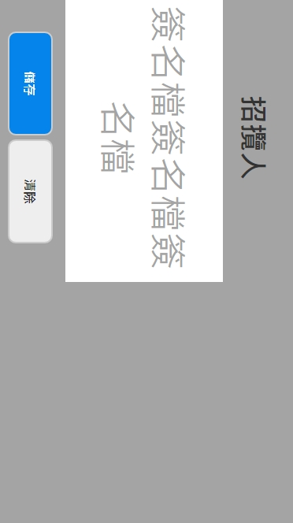

# 固定直式視窗，但要橫向顯示

各位前輩大家好，目前遇到一個 CSS 顯示問題，問題如下：

## 需求

要做一個簽名功能，其需求是手機與平板在直立式的時候要橫向滿版呈現。

畫面目前切好如下圖：


我嘗試了使用在 tablet 斷點做

```css
@include tablet {
  transform: rotate(90deg);
}
```

但是畫面會變成這樣，無法將畫面正確的顯示在正中央並滿版呈現，因為需要手機與平板都要顯示滿版樣式，一直無法成功。



嘗試了許久與找滿多資料都無法實作成功，實在沒辦法了，跟大家請求支援！
